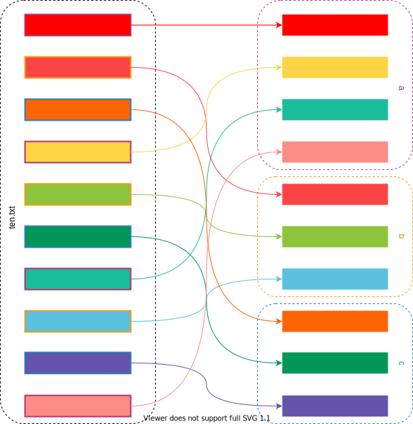

# zsplit


[](https://crates.io/crates/zsplit)
[](https://web.crev.dev/rust-reviews/crate/zsplit/)

Split text into multiple files.

## Usage

```console
$ zsplit --help
zsplit

ZSchoen <dev@zschoen.dev>

Split text into multiple files

USAGE:
    zsplit [OPTIONS] <SPLITTING_FILE>

ARGS:
    <SPLITTING_FILE>

OPTIONS:
    -d, --distribution <DISTRIBUTION>...
    -f, --line-factor <LINE_FACTOR>         [default: 1]
    -h, --help                              Print help information
    -n, --new-files <NEW_FILES>...
```

It splits the input into single lines and writes them Round Robin like to the output files.

### Examples

#### Setup

```console
$ seq 0 9 >test_folder/ten.txt; cat test_folder/ten.txt
0
1
2
[...]
8
9
```

#### Simple

```console
$ zsplit test_folder/ten.txt --new-files test_folder/{a,b,c}
$ cat test_folder/a
0
3
6
9
$ cat test_folder/b
1
4
7
$ cat test_folder/c
2
5
8
```



#### Unsymmetric Distribution

```console
$ zsplit test_folder/ten.txt --new-files test_folder/{a,b,c} --distribution 3 3 # The last distribution value is implicitly 1
$ cat test_folder/a
0
1
2
7
8
9
$ cat test_folder/b
3
4
5
$ cat test_folder/c
6
```

#### Multiple Lines

```console
$ zsplit test_folder/ten.txt --new-files test_folder/{a,b,c} --line-factor 2
$ cat test_folder/a
0
1
6
7
$ cat test_folder/b
2
3
8
9
$ cat test_folder/c
4
5
```

## Installation

### Cargo

```console
$ cargo install zsplit
```

## CREV - Rust code reviews - Raise awareness

Please, spread this info !\
Open source code needs a community effort to express trustworthiness.\
Start with reading the reviews of the crates you use. Example: [web.crev.dev/rust-reviews/crate/num-traits/](https://web.crev.dev/rust-reviews/crate/num-traits/) \
Than install the CLI [cargo-crev](https://github.com/crev-dev/cargo-crev)\. Read the [Getting Started guide](https://github.com/crev-dev/cargo-crev/blob/master/cargo-crev/src/doc/getting_started.md). \
On your Rust project, verify the trustworthiness of all dependencies, including transient dependencies with `cargo crev verify`\
Write a new review ! \
Describe the crates you trust. Or warn about the crate versions you think are dangerous.\
Help other developers, inform them and share your opinion.\
Use the helper on this webpage: [web.crev.dev/rust-reviews/review_new](https://web.crev.dev/rust-reviews/review_new)

