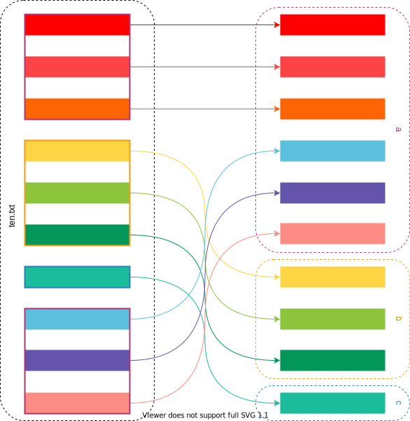

# zsplit


[](https://github.com/TheAlgorythm/zsplit/actions?query=workflow%3ARust)
[](https://crates.io/crates/zsplit)
[](https://web.crev.dev/rust-reviews/crate/zsplit/)

Split text into multiple files by line.

This is the library and not the CLI application. It is called `zsplit-cli`.

## Examples

#### Simple

```Rust
use zsplit::prelude::*;

let data = "0\n1\n2\n3\n4\n5\n6\n7\n8\n9";
let mut source = std::io::BufReader::new(data.as_bytes());
let mut destinations = vec![
    Destination::buffer(), // first_destination
    Destination::buffer(), // second_destination
    Destination::buffer(), // third_destination
];

split_round_robin(&mut source, &mut destinations).unwrap();

let third_destination = destinations.pop().unwrap();
let second_destination = destinations.pop().unwrap();
let first_destination = destinations.pop().unwrap();

assert_eq!(first_destination.into_utf8_string().unwrap(), "0\n3\n6\n9");
assert_eq!(second_destination.into_utf8_string().unwrap(), "1\n4\n7\n");
assert_eq!(third_destination.into_utf8_string().unwrap(), "2\n5\n8\n");
```


#### Unsymmetric Distribution

```Rust
use zsplit::prelude::*;

let data = "0\n1\n2\n3\n4\n5\n6\n7\n8\n9";
let mut source = std::io::BufReader::new(data.as_bytes());
let mut destinations = vec![
    Destination::buffer_with_lines(3), // first_destination
    Destination::buffer_with_lines(3), // second_destination
    Destination::buffer(), // third_destination
];

split_round_robin(&mut source, &mut destinations).unwrap();

let third_destination = destinations.pop().unwrap();
let second_destination = destinations.pop().unwrap();
let first_destination = destinations.pop().unwrap();

assert_eq!(first_destination.into_utf8_string().unwrap(), "0\n1\n2\n7\n8\n9\n");
assert_eq!(second_destination.into_utf8_string().unwrap(), "3\n4\n5\n");
assert_eq!(third_destination.into_utf8_string().unwrap(), "6\n");
```



## CREV - Rust code reviews - Raise awareness

Please, spread this info !\
Open source code needs a community effort to express trustworthiness.\
Start with reading the reviews of the crates you use. Example: [web.crev.dev/rust-reviews/crate/num-traits/](https://web.crev.dev/rust-reviews/crate/num-traits/) \
Than install the CLI [cargo-crev](https://github.com/crev-dev/cargo-crev)\. Read the [Getting Started guide](https://github.com/crev-dev/cargo-crev/blob/master/cargo-crev/src/doc/getting_started.md). \
On your Rust project, verify the trustworthiness of all dependencies, including transient dependencies with `cargo crev verify`\
Write a new review ! \
Describe the crates you trust. Or warn about the crate versions you think are dangerous.\
Help other developers, inform them and share your opinion.\
Use the helper on this webpage: [web.crev.dev/rust-reviews/review_new](https://web.crev.dev/rust-reviews/review_new)

